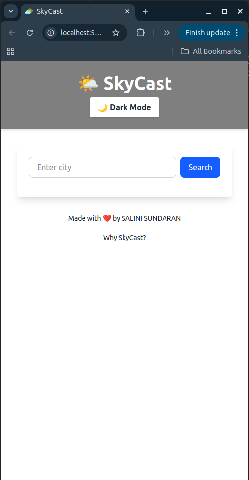
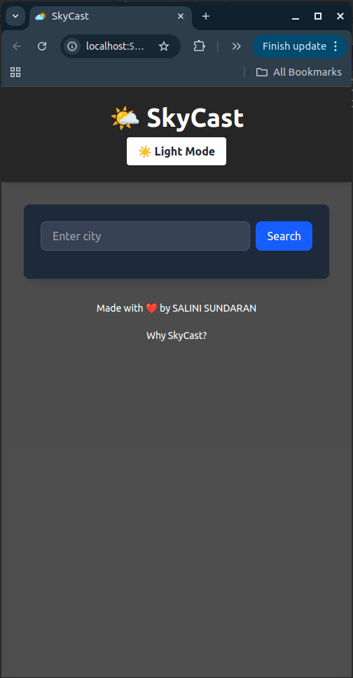
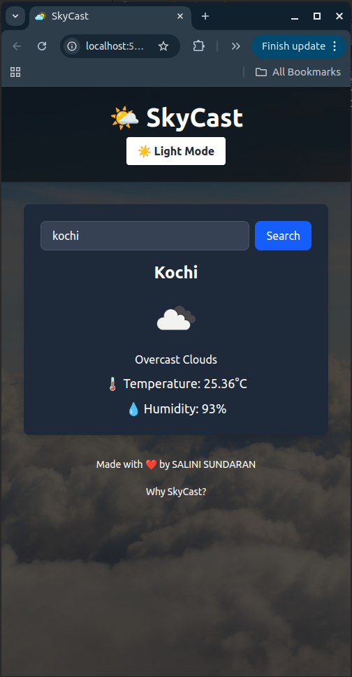
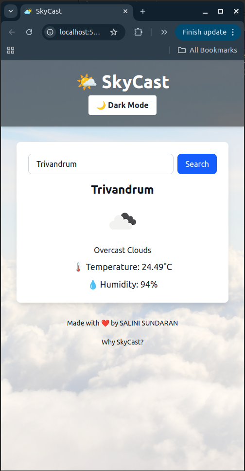
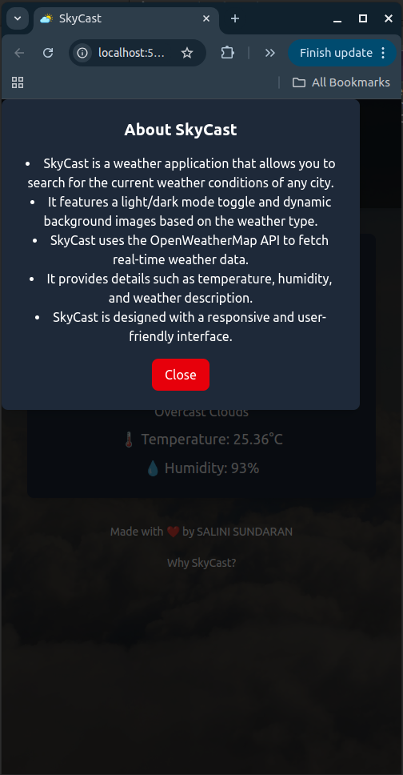

# SkyCast 🌤️
SkyCast is a modern weather forecasting application that provides accurate and up-to-date weather information for any location. With its sleek interface and reliable data, SkyCast helps you plan your day with confidence.
---

## 🌟 Features

- **🌍 Current Weather**: Get real-time weather updates for your location.
- **🔍 Search Locations**: Check weather conditions for any city or region.
- **🌗 Dark/Light Mode**: Switch between dark and light themes for a personalized experience.

---

## 📸 Screenshots

### Home Screen





### About SkyCast


---

## 🎥 Demo Video

[]

---

## 🚀 Installation

1. Clone the repository:
    ```bash
    git clone https://github.com/SaliniSundaran2002/SkyCast.git
    ```
2. Navigate to the project directory:
    ```bash
    cd SkyCast
    ```
3. Install dependencies:
    ```bash
    npm install
    ```
4. Start the application:
    ```bash
    npm start
    ```

---

## 🌐 OpenWeatherMap API Integration

SkyCast uses the OpenWeatherMap API to fetch accurate and reliable weather data. Follow these steps to get your API key:

1. Sign up at [OpenWeatherMap](https://openweathermap.org/) if you don't already have an account.
2. Navigate to the API keys section in your account dashboard.
3. Generate a new API key and copy it.

To use the API key in SkyCast:

1. Create a `.env` file in the root directory of the project.
2. Add your API key to the `.env` file:
    ```env
    VITE_WEATHER_API_KEY=your_api_key_here
    ```
3. Restart the application to apply the changes.

For more details, refer to the [OpenWeatherMap API Documentation](https://openweathermap.org/api).

## 🛠️ Technologies Used

- **Frontend**: React, Tailwind CSS
- **API**: OpenWeatherMap API

---

> "The best way to predict the future is to create it." – Peter Drucker
